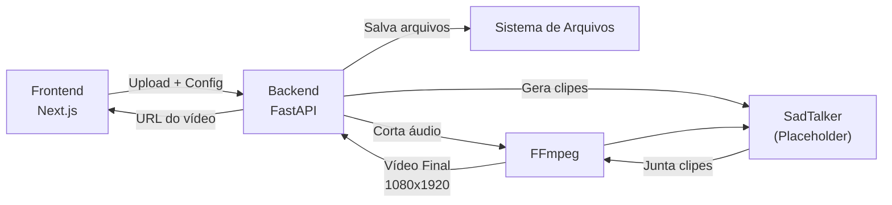
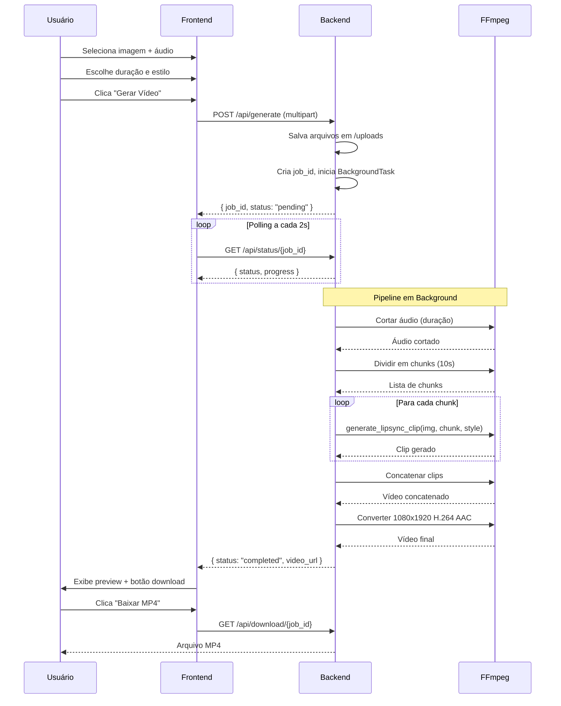

# Ferramenta Local de Lip Sync para Vídeos Curtos Verticais

Criar uma aplicação local completa que permite gerar vídeos lip sync verticais (9:16) a partir de uma imagem estática e um arquivo de áudio, prontos para YouTube Shorts, TikTok e Instagram Reels.

## Visão Geral da Arquitetura



---

## Estrutura de Pastas do Projeto

```
lipsync/
├── frontend/                    # Next.js App
│   ├── src/
│   │   ├── app/
│   │   │   ├── layout.js
│   │   │   ├── page.js          # Página principal
│   │   │   └── globals.css      # Estilos globais
│   │   ├── components/
│   │   │   ├── FileUpload.jsx   # Componente de upload
│   │   │   ├── ConfigPanel.jsx  # Painel de configuração (duração + estilo)
│   │   │   ├── ProgressBar.jsx  # Barra de progresso
│   │   │   └── VideoPreview.jsx # Preview + botão de download
│   │   └── lib/
│   │       └── api.js           # Funções de chamada à API
│   ├── public/
│   ├── package.json
│   ├── next.config.js
│   └── jsconfig.json
│
├── backend/
│   ├── main.py                  # Entry point FastAPI
│   ├── routers/
│   │   └── generate.py          # Endpoint de geração
│   ├── services/
│   │   ├── audio_processor.py   # Cortar e processar áudio
│   │   ├── lipsync_engine.py    # Placeholder SadTalker
│   │   └── video_composer.py    # Juntar clipes + exportar final
│   ├── schemas/
│   │   └── models.py            # Modelos Pydantic
│   ├── config.py                # Configurações e caminhos
│   ├── requirements.txt
│   └── utils/
│       └── file_manager.py      # Gerenciamento de arquivos
│
├── uploads/
│   ├── images/
│   └── audio/
├── outputs/
├── temp/
└── README.md
```

---

## Decisões Técnicas

> [!IMPORTANT]
> **SadTalker como Placeholder:** A função `generate_lipsync_clip()` será implementada como um placeholder que gera um vídeo simples (imagem estática + áudio) usando FFmpeg. Quando o SadTalker for integrado, basta substituir o corpo dessa função.

> [!IMPORTANT]
> **FFmpeg via subprocess:** Os comandos `ffmpeg` e `ffprobe` serão executados diretamente com `subprocess.run(..., check=True)`, sem depender de wrappers como `ffmpeg-python`. Isso mantém o pipeline explícito, simples de debugar e alinhado aos comandos documentados neste plano.

> [!NOTE]
> **Divisão em Trechos:** Áudios maiores que 10s serão divididos em chunks de até 10s. Isso simula a limitação real do SadTalker, que tem melhor performance em clips curtos. Cada chunk gera um clipe que depois é concatenado.

> [!NOTE]
> **Processamento Assíncrono:** O endpoint de geração usa `BackgroundTasks` do FastAPI. O frontend faz polling no status via um endpoint dedicado.

> [!NOTE]
> **Estado dos Jobs em Memória:** O status dos jobs ficará em um dicionário em memória por ser uma ferramenta local. Se o backend reiniciar, jobs em andamento ou concluídos deixam de estar registrados. Persistência em SQLite ou arquivo JSON pode ser adicionada depois, se necessário.

> [!NOTE]
> **Diretórios Gerados:** O projeto usa `outputs/` para vídeos finais. O `.gitignore` deve ignorar `outputs/`, `temp/` e `uploads/` para não versionar arquivos gerados, mídia enviada ou artefatos temporários.

---

## Alterações Propostas

### Backend — FastAPI

#### [NEW] [config.py](file:///c:/Users/User/Documents/PAULO%20VITOR/lipsync/backend/config.py)
- Definir caminhos base: `UPLOADS_DIR`, `OUTPUTS_DIR`, `TEMP_DIR`, `IMAGES_DIR`, `AUDIO_DIR`
- Definir extensões permitidas: imagens (`png`, `jpg`, `jpeg`) e áudio (`mp3`, `wav`)
- Definir durações válidas: `[8, 15, 30, 60]`
- Definir estilos válidos: `["natural", "emocional", "intenso"]`
- Definir `MAX_CHUNK_DURATION = 10` (segundos)

#### [NEW] [schemas/models.py](file:///c:/Users/User/Documents/PAULO%20VITOR/lipsync/backend/schemas/models.py)
- Não criar `GenerateRequest` para `/api/generate`, pois esse endpoint recebe `multipart/form-data` com `UploadFile` e campos `Form`
- `GenerateResponse`: modelo com `job_id: str`, `status: str`
- `JobStatus`: modelo com `job_id: str`, `status: str` (pending/processing/completed/failed), `progress: int` (0-100), `video_url: Optional[str]`, `error: Optional[str]`

#### [NEW] [main.py](file:///c:/Users/User/Documents/PAULO%20VITOR/lipsync/backend/main.py)
- Criar app FastAPI com CORS habilitado (origin: `http://localhost:3000`)
- Montar rota estática para servir `/outputs` e `/uploads`
- Incluir router de `generate`
- Criar as pastas necessárias no startup (`uploads/images`, `uploads/audio`, `outputs`, `temp`)
- Endpoint de health check: `GET /api/health`

#### [NEW] [routers/generate.py](file:///c:/Users/User/Documents/PAULO%20VITOR/lipsync/backend/routers/generate.py)
- `POST /api/generate` — Recebe:
  - `image: UploadFile` (validar extensão png/jpg/jpeg)
  - `audio: UploadFile` (validar extensão mp3/wav)
  - `duration: int` (Form field, validar: 8, 15, 30, 60)
  - `style: str` (Form field, validar: natural, emocional, intenso)
  - Salva arquivos em `uploads/images` e `uploads/audio` com UUID no nome
  - Cria um `job_id` (UUID)
  - Inicia processamento como `BackgroundTask`
  - Retorna `{ job_id, status: "pending" }`

- `GET /api/status/{job_id}` — Retorna status atual do job:
  - Usa um dicionário em memória `jobs: Dict[str, JobStatus]`
  - Retorna `{ job_id, status, progress, video_url, error }`

- `GET /api/download/{job_id}` — Retorna o arquivo de vídeo como `FileResponse`

#### [NEW] [services/audio_processor.py](file:///c:/Users/User/Documents/PAULO%20VITOR/lipsync/backend/services/audio_processor.py)
- `get_audio_duration(audio_path: str) -> float` — Usa `ffprobe` via `subprocess.run` para obter duração
- `trim_audio(audio_path: str, duration: int, output_path: str) -> str` — Corta áudio na duração especificada usando `ffmpeg` via `subprocess.run`
- `split_audio_chunks(audio_path: str, chunk_duration: int = 10) -> List[str]` — Divide o áudio em chunks de até N segundos usando `ffmpeg` via `subprocess.run`. Retorna lista de caminhos dos chunks. Se duração ≤ chunk_duration, retorna lista com um único item

#### [NEW] [services/lipsync_engine.py](file:///c:/Users/User/Documents/PAULO%20VITOR/lipsync/backend/services/lipsync_engine.py)
- `generate_lipsync_clip(image_path: str, audio_chunk_path: str, style: str, output_path: str) -> str`
  - **Placeholder atual:** Gera vídeo com imagem estática + áudio usando FFmpeg
    ```
    ffmpeg -loop 1 -i image.jpg -i audio.wav -c:v libx264 -tune stillimage 
           -c:a aac -b:a 192k -pix_fmt yuv420p -shortest output.mp4
    ```
  - Docstring explicando como substituir por SadTalker:
    ```python
    # Para integrar SadTalker, substituir o corpo por:
    # subprocess.run([
    #     "python", "inference.py",
    #     "--driven_audio", audio_chunk_path,
    #     "--source_image", image_path,
    #     "--result_dir", output_dir,
    #     "--enhancer", "gfpgan",
    #     "--still",  # modo "still" para menos movimentação
    # ], cwd=SADTALKER_PATH)
    ```
  - Parâmetro `style` mapeado para configurações futuras do SadTalker

#### [NEW] [services/video_composer.py](file:///c:/Users/User/Documents/PAULO%20VITOR/lipsync/backend/services/video_composer.py)
- `concat_clips(clip_paths: List[str], output_path: str) -> str` — Concatena múltiplos clipes usando FFmpeg concat demuxer (cria arquivo `filelist.txt` temporário)
- `convert_to_vertical(input_path: str, output_path: str) -> str` — Converte vídeo para 1080x1920, H.264, AAC:
  ```
  ffmpeg -i input.mp4 -vf "scale=1080:1920:force_original_aspect_ratio=decrease,
         pad=1080:1920:-1:-1:color=black" -c:v libx264 -crf 20 -c:a aac output.mp4
  ```
- `process_full_pipeline(job_id, image_path, audio_path, duration, style, jobs_dict)` — Orquestra todo o pipeline:
  1. Atualiza status para "processing" (progress: 10%)
  2. Corta áudio na duração → progress: 20%
  3. Divide em chunks → progress: 30%
  4. Para cada chunk, chama `generate_lipsync_clip` → progress: 30-80% (distribuído)
  5. Concatena clips → progress: 85%
  6. Converte para vertical 1080x1920 → progress: 95%
  7. Move para `outputs/` → progress: 100%, status: "completed"
  8. Limpa arquivos temporários
  9. Em caso de erro: status: "failed", error: mensagem

#### [NEW] [utils/file_manager.py](file:///c:/Users/User/Documents/PAULO%20VITOR/lipsync/backend/utils/file_manager.py)
- `save_upload(file: UploadFile, directory: str) -> str` — Salva arquivo com nome UUID, retorna caminho
- `cleanup_temp(job_id: str)` — Remove arquivos temporários do job
- `validate_file_extension(filename: str, allowed: List[str]) -> bool`

#### [NEW] [requirements.txt](file:///c:/Users/User/Documents/PAULO%20VITOR/lipsync/backend/requirements.txt)
```
fastapi==0.115.0
uvicorn[standard]==0.30.0
python-multipart==0.0.9
pydantic==2.9.0
```

> FFmpeg precisa estar instalado no sistema e disponível no `PATH`; ele não será instalado pelo `requirements.txt`.

---

### Frontend — Next.js

#### [NEW] Projeto Next.js
- Inicializar com `npx -y create-next-app@latest ./frontend` (App Router, sem TypeScript, sem Tailwind, com src/, sem Turbopack)
- Se o comando não estiver disponível por restrição de rede/ambiente, criar manualmente a estrutura mínima do Next.js com `package.json`, `next.config.js`, `jsconfig.json`, `src/app` e `src/components`

#### [NEW] [src/app/globals.css](file:///c:/Users/User/Documents/PAULO%20VITOR/lipsync/frontend/src/app/globals.css)
- **Design System Completo:**
  - Tema escuro operacional com base neutra e acentos controlados em ciano, magenta, verde e âmbar, evitando domínio visual de uma única família de cor
  - Variáveis CSS para cores, espaçamentos, bordas, sombras
  - Fonte: Inter (Google Fonts)
  - Superfícies translúcidas moderadas apenas onde ajudarem a separar upload, configuração e preview
  - Animações suaves: fade-in, pulse, shimmer
  - Responsivo para desktop e mobile
  - Estilização completa de todos os componentes

#### [NEW] [src/app/layout.js](file:///c:/Users/User/Documents/PAULO%20VITOR/lipsync/frontend/src/app/layout.js)
- Layout raiz com metadata SEO
- Import da fonte Inter
- Import do globals.css

#### [NEW] [src/app/page.js](file:///c:/Users/User/Documents/PAULO%20VITOR/lipsync/frontend/src/app/page.js)
- Página principal com estado da aplicação:
  - `imageFile`, `audioFile` — arquivos selecionados
  - `duration` — duração escolhida (default: 15)
  - `style` — estilo escolhido (default: "natural")
  - `jobId` — ID do job em processamento
  - `status` — status atual (idle/pending/processing/completed/failed)
  - `progress` — progresso (0-100)
  - `videoUrl` — URL do vídeo gerado
- Layout: header → upload area → config → botão gerar → progresso → preview
- Lógica de polling: a cada 2s consulta `/api/status/{job_id}` enquanto status != completed/failed

#### [NEW] [src/components/FileUpload.jsx](file:///c:/Users/User/Documents/PAULO%20VITOR/lipsync/frontend/src/components/FileUpload.jsx)
- Componente reutilizável para upload com drag & drop
- Props: `accept`, `label`, `icon`, `onFileSelect`, `file`
- Visual: zona de drop com ícone, texto de instrução, preview do nome do arquivo
- Validação de extensão no frontend

#### [NEW] [src/components/ConfigPanel.jsx](file:///c:/Users/User/Documents/PAULO%20VITOR/lipsync/frontend/src/components/ConfigPanel.jsx)
- Grupo de botões para duração: 8s, 15s, 30s, 60s
- Grupo de botões para estilo: Natural, Emocional, Intenso
- Visual: botões com hover e estado ativo destacado

#### [NEW] [src/components/ProgressBar.jsx](file:///c:/Users/User/Documents/PAULO%20VITOR/lipsync/frontend/src/components/ProgressBar.jsx)
- Barra de progresso animada com gradiente
- Exibe porcentagem e mensagem de status
- Animação de pulse enquanto processando

#### [NEW] [src/components/VideoPreview.jsx](file:///c:/Users/User/Documents/PAULO%20VITOR/lipsync/frontend/src/components/VideoPreview.jsx)
- Player de vídeo HTML5 com controles
- Proporção 9:16 no preview
- Botão de download estilizado abaixo do player
- Animação de fade-in ao aparecer

#### [NEW] [src/lib/api.js](file:///c:/Users/User/Documents/PAULO%20VITOR/lipsync/frontend/src/lib/api.js)
- `API_BASE = "http://localhost:8000"`
- `generateVideo(imageFile, audioFile, duration, style)` — POST multipart/form-data para `/api/generate`, retorna `{ job_id, status }`
- `getJobStatus(jobId)` — GET `/api/status/{jobId}`, retorna `{ job_id, status, progress, video_url, error }`
- `getDownloadUrl(jobId)` — Retorna URL para `/api/download/{jobId}`
- `getVideoStreamUrl(videoUrl)` — Retorna URL completa para streaming

---

### Documentação

#### [NEW] [README.md](file:///c:/Users/User/Documents/PAULO%20VITOR/lipsync/README.md)
Conteúdo:
- Título e descrição do projeto
- Screenshot/GIF placeholder
- Pré-requisitos: Node.js 18+, Python 3.10+, FFmpeg instalado no PATH
- Instalação passo a passo:
  ```bash
  # Backend
  cd backend
  python -m venv venv
  venv\Scripts\activate  # Windows
  pip install -r requirements.txt
  
  # Frontend
  cd frontend
  npm install
  ```
- Execução:
  ```bash
  # Terminal 1 — Backend
  cd backend
  uvicorn main:app --reload --port 8000
  
  # Terminal 2 — Frontend
  cd frontend
  npm run dev
  ```
- Acessar: `http://localhost:3000`
- Seção sobre integração com SadTalker (futura)
- Estrutura de pastas explicada
- Licença: MIT

---

## Fluxo de Processamento Detalhado



---

## Design da Interface

### Layout Principal
```
┌──────────────────────────────────────────────┐
│            🎵 LipSync Studio                 │
│      Crie vídeos lip sync verticais          │
├──────────────────────────────────────────────┤
│                                              │
│  ┌─────────────────┐ ┌─────────────────┐    │
│  │  📷 Upload      │ │  🎵 Upload      │    │
│  │  Imagem         │ │  Áudio          │    │
│  │  (drag & drop)  │ │  (drag & drop)  │    │
│  └─────────────────┘ └─────────────────┘    │
│                                              │
│  Duração: [8s] [15s] [30s] [60s]            │
│                                              │
│  Estilo: [Natural] [Emocional] [Intenso]    │
│                                              │
│  ┌──────────────────────────────────────┐    │
│  │         🎬 Gerar Vídeo               │    │
│  └──────────────────────────────────────┘    │
│                                              │
│  ████████████████░░░░░░  72% Processando... │
│                                              │
│  ┌────────────┐                              │
│  │            │                              │
│  │  Preview   │                              │
│  │   9:16     │                              │
│  │            │                              │
│  └────────────┘                              │
│  [ ⬇ Baixar MP4 ]                           │
│                                              │
└──────────────────────────────────────────────┘
```

### Estética
- **Tema:** Dark mode com base neutra e acentos em ciano, magenta, verde e âmbar
- **Superfícies:** Blocos bem definidos para upload, configuração e preview, com transparência moderada e sem excesso de cards aninhados
- **Fonte:** Inter (Google Fonts)
- **Animações:** Fade-in nos componentes, pulse na barra de progresso, hover com scale nos botões
- **Botão principal:** Contraste alto, estado hover claro e feedback de carregamento enquanto o job está em execução

---

## Plano de Verificação

### Testes Automatizados
```bash
# 1. Verificar se o backend inicia sem erros
cd backend
uvicorn main:app --port 8000

# 2. Testar health check
curl http://localhost:8000/api/health

# 3. Verificar se o frontend compila
cd frontend
npm run build

# 4. Testar upload de arquivos via curl
curl -X POST http://localhost:8000/api/generate \
  -F "image=@test_image.jpg" \
  -F "audio=@test_audio.mp3" \
  -F "duration=15" \
  -F "style=natural"
```

### Verificação Manual via Browser
1. Abrir `http://localhost:3000`
2. Fazer upload de uma imagem JPG e um áudio MP3
3. Selecionar duração 15s e estilo "Natural"
4. Clicar "Gerar Vídeo"
5. Verificar que a barra de progresso avança
6. Verificar que o preview aparece ao concluir
7. Clicar "Baixar MP4" e verificar que o arquivo é válido
8. Verificar que o vídeo é 1080x1920, H.264, AAC

### Validações Específicas
- [ ] Pastas são criadas automaticamente no startup
- [ ] Extensões inválidas são rejeitadas (frontend e backend)
- [ ] Áudio é cortado corretamente na duração escolhida
- [ ] Áudios > 10s são divididos em chunks corretos
- [ ] Chunks são processados e concatenados na ordem
- [ ] Vídeo final tem resolução 1080x1920
- [ ] Vídeo final tem codec H.264 e áudio AAC
- [ ] Arquivos temporários são limpos após processamento
- [ ] CORS permite chamadas do localhost:3000
- [ ] Polling de status funciona corretamente
- [ ] Erros são tratados e exibidos ao usuário

---

## Ordem de Implementação

| Fase | O quê | Estimativa |
|------|--------|-----------|
| 1 | Backend: `config.py`, `schemas/models.py`, `utils/file_manager.py` | Fundação |
| 2 | Backend: `services/audio_processor.py` | Processamento de áudio |
| 3 | Backend: `services/lipsync_engine.py` (placeholder) | Motor de geração |
| 4 | Backend: `services/video_composer.py` | Composição de vídeo |
| 5 | Backend: `routers/generate.py`, `main.py` | API endpoints |
| 6 | Frontend: Inicializar Next.js + globals.css | Base do frontend |
| 7 | Frontend: Componentes (FileUpload, ConfigPanel, ProgressBar, VideoPreview) | UI |
| 8 | Frontend: `lib/api.js` + `page.js` (integração) | Integração |
| 9 | README.md | Documentação |
| 10 | Teste end-to-end completo | Verificação |
